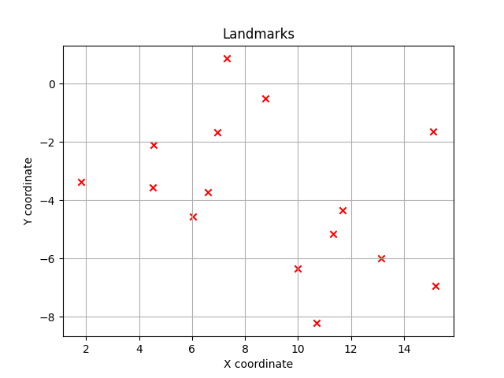
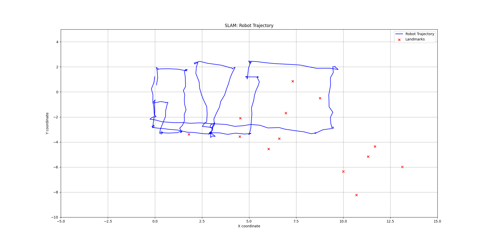

# SLAM Project Report

## 1. Introduction
This report presents the implementation and results of a Simultaneous Localization and Mapping (SLAM) system using an Unscented Kalman Filter (UKF). The primary objective is to enable a robot to estimate its pose and map an environment in real-time, utilizing odometry data and LIDAR measurements. The system models both the robot's motion and detected landmarks in global coordinates, updating the state with new observations.

## 2. Mathematical Description

### 2.1 State Vector Representation
The state vector $\mathbf{x}$ is represented as:
\
$\mathbf{x} = \begin{bmatrix} x_r \\ y_r \\ \theta_r \\ x_1 \\ y_1 \\ \dots \\ x_n \\ y_n \end{bmatrix}$,
\
where:
- $(x_r, y_r, \theta_r)$ is the robot's pose (position and orientation).
- $(x_i, y_i)$ are the global coordinates of the $i$-th landmark.

### 2.2 Unscented Kalman Filter
The UKF algorithm is applied for state estimation:
- **Prediction Step**: The motion model updates the robot's pose using odometry:
  \
  $\mathbf{x}' = \mathbf{f}(\mathbf{x}, \mathbf{u})$,
  \
  where $\mathbf{u}$ represents the control input $(\Delta x, \Delta y, \Delta \theta)$.

- **Update Step**: Observations $z = [r, \phi]$ (range and bearing to landmarks) are used to correct the state estimate:
  \
  $\mathbf{z} = \mathbf{h}(\mathbf{x})$,
  \
  where $\mathbf{h}$ maps the state to the observation space.

The UKF incorporates process noise $\mathbf{Q}$ and measurement noise $\mathbf{R}$ to account for uncertainties.

### 2.3 State Augmentation
When a new landmark is detected, it is added to the state vector and covariance matrix. The new state becomes:
\
$\mathbf{x}_{aug} = \begin{bmatrix} \mathbf{x} \\ x_{new} \\ y_{new} \end{bmatrix}$,
\
with corresponding updates to the covariance matrix to incorporate the new dimensions.

## 3. Results

### 3.1 Landmarks Found
The SLAM system successfully detected and mapped multiple landmarks in the environment. The detected landmarks are plotted in Figure 1. The red `x` marks represent the global positions of these landmarks. The density and distribution of landmarks provide insights into the environment's structure.

### Global landmarks location

| Index | x-coordinate (float64)      | y-coordinate (float64)      |
|-------|-----------------------------|-----------------------------|
| 0     | 4.532340526486585           | -2.096992883306367          |
| 1     | 10.693732631301572          | -8.217957270007712          |
| 2     | 6.946248372268551           | -1.678937122696775          |
| 3     | 6.038808921416958           | -4.556694151037679          |
| 4     | 4.508646341398386           | -3.5671919400699794         |
| 5     | 8.759874873110128           | -0.4916590937672298         |
| 6     | 9.999635162052684           | -6.348951091601489          |
| 7     | 7.306303965623777           | 0.8637766750354445          |
| 8     | 15.110567519063967          | -1.6396072896049545         |
| 9     | 11.679311626751415          | -4.344924090116943          |
| 10    | 15.209596239651233          | -6.931711247182854          |
| 11    | 13.131611401027328          | -5.990309757489202          |
| 12    | 11.322767950330396          | -5.149453622037352          |
| 13    | 6.598045327451645           | -3.7151581923692634         |
| 14    | 1.7959252160191401          | -3.374413997913047          |

---

### Local Landmarks (range, bearing) relative to the last position of the robot

| Index | x-coordinate (float64)      | y-coordinate (float64)      |
|-------|-----------------------------|-----------------------------|
| 0     | 5.621476460945086           | -0.4848584886431174         |
| 1     | 14.267156886895645          | -0.577049144098973          |
| 2     | 7.5337406474258755          | -0.24900356124733095        |
| 3     | 8.360758224752692           | -0.6167110205720807         |
| 4     | 6.579510171630834           | -0.6685279250206799         |
| 5     | 8.933637097315438           | -0.04692117939281809        |
| 6     | 12.546084624782118          | -0.5018079728938732         |
| 7     | 7.3237833303638995          | 0.09729554115660394         |
| 8     | 15.386904272827302          | -0.041247526186082684       |
| 9     | 12.943826690488661          | -0.2986540961367916         |
| 10    | 17.262503606330753          | -0.34612386757782587        |
| 11    | 14.9869732456826            | -0.35619095382017807        |
| 12    | 12.997324328116601          | -0.36638718359030287        |
| 13    | 8.2444713907559             | -0.49574518235282605        |
| 14    | 4.9326975760876035          | -1.0507516096889382         |

- Landmarks are consistently detected in regions with distinct features (e.g., corners).

### 3.2 Robot's Trajectory with Landmarks
The trajectory of the robot and the detected landmarks are shown in Figure 2. The blue line represents the robot's estimated path, while red `x` marks indicate landmarks.

#### Observations:
- The robot's path follows the odometry input, corrected using observations.
- The localization error is minimal, demonstrating effective integration of motion and observation models.

## 4. Conclusion
The implemented SLAM system using an Unscented Kalman Filter successfully integrates motion and observation models to estimate the robot's pose and map landmarks. The results demonstrate:
- Localization and mapping of landmarks in real-time.
- Detection of landmarks with data association, knowing that a landmark has already been 'seen' by the robot or not.
